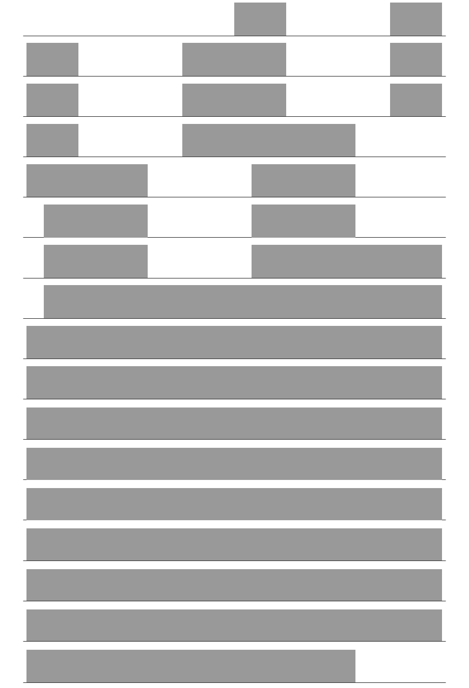
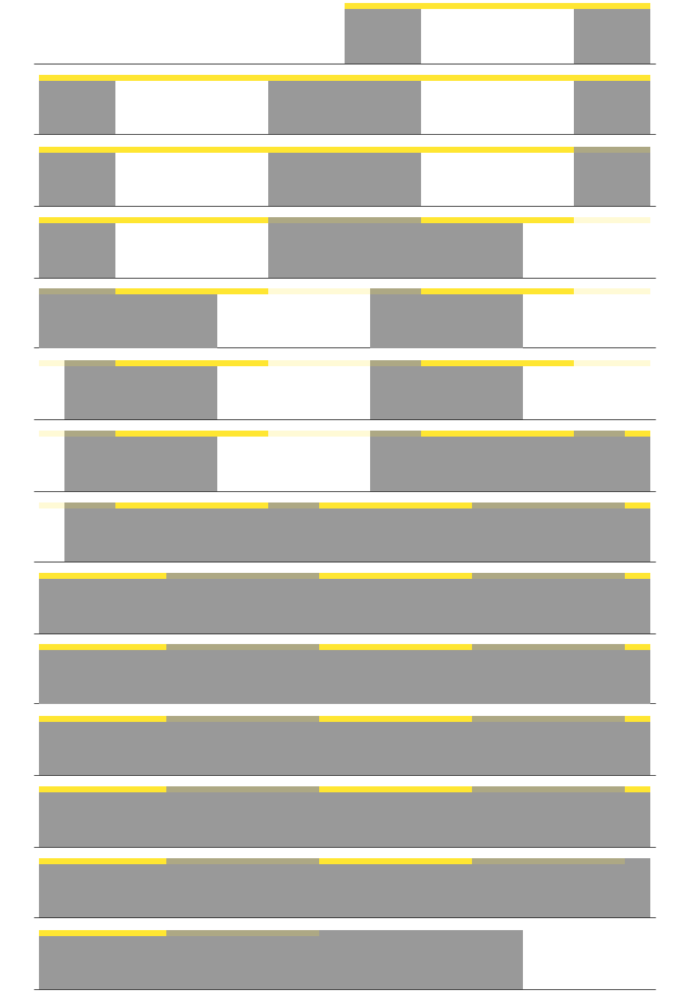

# DAM analyzer Guide

This guide provides instructions on how to use the DAM Analyzer, a MATLAB-based tool for analyzing Drosophila Activity Monitor (DAM) data. The data to be analyzed should be merged by 30-min bins as MyRun data in the DAM system. 

The DAM Analyzer consists of two main scripts: `DAM_stat.m` and `DAM_actograph.m`. The `DAM_stat.m` is used to analyze the activity, period, and anticipation of individual flies and groups. The `DAM_actograph.m` is used to visualize the activity of individual flies and groups in actographs.

## Requirements

MATLAB R2022b or later (Tested on R2022b, R2023b. It may work on earlier versions, but not guaranteed.)

MATLAB Parallel Computing Toolbox

MATLAB Statistics and Machine Learning Toolbox

## Usage of DAM_stat.m

### Input Parameters

1. **Data Folder**: Store all text files containing DAM data from the same experiment in one folder. Specify this folder path in `datafolder`. The txt files should be merged __30-min interval data__ in the DAM system.

``` matlab
datafolder = "/Your/Folder/Path";
% or 
datafolder = '/Your/Folder/Path';
```

Alternatively, you can leave `datafolder` empty to manually select the folder after running the script.

``` matlab
datafolder = "";
% or
datafolder = '';
```

2. **Group Information**: Define the groups in your experiment using `group` and provide custom names for these groups in `group_names`. Both variables are cell arrays, so use `{ }`. Each item in the cell corresponds to a group. Ensure that `group` and `group_names` are of equal length.

``` matlab
group = {1:5, [6,8,10,12], [7,9,13:32]}
group_names = {'WT', 'mutant1', 'mutant2'}
```

**Multi-Index Grouping:** If the grouping of different txt files is not consistent, you can use the multi-index method to group the flies. Please note that each element in the `group` cell array should be a cell array of indices, which are the indices of the flies in the corresponding txt file. Each txt data file should have a corresponding cell array of indices in the `group` cell array. In the following example, the `group` cell array has 5 elements, corresponding to 5 txt data files, and each of which has 3 groups of flies, such as `W1118`, `Canton-S`, and `Mutant`. If a specific kind of flies are not included in the txt file, you can leave the corresponding cell array empty as `[]`.

``` matlab

```matlab
group = {
    {[1 3 5], [2 4 6 8:12], [15:32]};
    {[5:8],   [],           [1:4 9:32]};
    {[1 3 5], [2 4 6 8:12], [15:32]};
    {[1:16],  [17:32],      []};
    {[1 4 7], [2 3 5 6],    [8:32]};    
};
group_names = {'W1118', 'Canton-S', 'Mutant'};
```

3. **Time Range**: Specify time range for analysis using `time_start` and `time_end`. Both `time_start` and `time_end` are included in the data slice. And the time range should be a multiple of 24 h (48 rows, each row for data of 30 min). So, the following example means the data collected from 2023-12-19 08:00 to 2023-12-24 08:00 (the data collected in 08:00 to 08:30 is saved in the row 8:30, thus set the `time_start` to `'2023-12-19 08:30:00'`).

``` matlab
time_start = '2023-12-19 08:30:00'; % 'yyyy-MM-dd HH:mm:ss'
time_end   = '2023-12-24 08:00:00';
```

4. **Light-Dark Cycle**: If the time range is in the LD cycles, specify when the lights are turned on in `light_on`, and the duration of "L" in `light_on_duration` in hours. The duration of "D" will be equal to `24 - light_on_duration`. The morning/evening anticipations will be calculated based on these parameters.

``` matlab
light_on = '08:00:00';
light_on_duration = 12;
```

If the time range is in the DD cycles, leave the `light_on` empty, and the morning/evening anticipations will not be calculated.

``` matlab
light_on = '';
```

5. **Periodogram Calculation**: Select a method to calculate and plot the periodogram in `period_method`. `"Chi-Square" ("Enright")` , `"Lomb-Scargle"`, `"greedy Chi-Square"` and `"Cosinor"` are available. You can also set the confidence level for analysis in `confidence_level`.

``` matlab
period_method = "greedy Chi-Square";
confidence_level = 0.95;
```

for more infomation about these methods, you can find at:

- Enright (chi-square) is from Sokolove P.G., & Bushell W.N., 1978, J Theor Biol; Refinetti R., ..., & Halberg G., 2007, Biol Rhythm Res.
- Lomb-Scargle is from Refinetti R., ..., & Halberg G., 2007, Biol Rhythm Res.
- Cosinor is from Cornelissen G., 2014, Theor Biol Med Model; Refinetti R., ..., & Halberg G., 2007, Biol Rhythm Res.
- greedy chi-square is from Tackenberg M.C., & Hughey J.J., 2021, PLoS Comput Biol.

1. **Death Exclusion**: This code will automatically locate the death time of each fly. If a fly died in your selected time range, you can exclude the data of the fly by setting `isToExcludeDeath` to `true`.

``` matlab
isToExcludeDeath = true;
```

7. **Picture Format and Resolution**: Set the picture format and resolution in `picture_format` and `picture_resolution`. `'pdf'` is recommended for vector graphics and `'png'` is recommended for pixel graphics. The resolution setting only works for pixel graphics. For more formats please see the documentation of `print` function of MATLAB by typing `doc print` in the command window.

``` matlab
picture_format = 'pdf';
picture_resolution = 150;
```

8. **Font Size**: The font size on the figure can be set using `picture_fontsize`. If you leave it empty `picture_fontsize = []`, the font size will be set automatically.

``` matlab
picture_fontsize = 16;
```

9. **Bar Plot**: Using these parameters, you can set the Y-axis limit, facecolor, edgecolor, bar width of the bar plot of activity by `Y_max_activity`, `bar_facecolor`, `bar_edgecolor`, `bar_width`. The `Y_max_activity` is the limit of Y-axis in the bar plot. The `bar_facecolor` and `bar_edgecolor` are the color of the bar and the edge of the bar, respectively. The `bar_width` is the relative width of the bar. The `bar_facecolor_middle` is the color of the bars from T6 to T18. If you want to set the color of the bars from T6 to T18 to white for Light ON, you can set the `bar_facecolor_middle` to `[1 1 1]`. If you want to set the color of the bars from T6 to T18 to light gray for subjective L,you can set the `bar_facecolor_middle` to `[0.7 0.7 0.7]` or other colors you like.

``` matlab
Y_max_activity = 50; 
bar_facecolor = [0.5 0.5 0.5]; % RGB array from 0 to 1, 16-bit color in string, or color name in string.
bar_edgecolor = [0 0 0]; 
bar_width = 1; 

% if you want to set the color of the bars from T6 to T18 to white for Light ON, you can use the following code. 
if ~isempty(light_on) % when `light_on` is set.
    bar_facecolor_middle = [1 1 1]; % color of the bars from T6 to T18
else % when `light_on` is empty.
    bar_facecolor_middle = [0.7 0.7 0.7];
end

```

### Output Files

All files will be saved in a new folder with the name starting with "stat" and ending with your selected time range, such as "stat_12190830-12240800", in the `datafolder`.

In the "`stat_[daterange]`" folder, there will be 4 folders named "`data`", "`period`", "`activity_bars`", "`groups`", and an "`info_[daterange].m`" file.

- The "`info_[daterange].m`" file contains parameters.
- The "`data`" folder contains all extracted activities, calculated period data and anticipations of all individual flies. see more details in the codes.
- The "`activity_bars`" folder contains the figures of individual fly activity of the selected time range, which are averaged across days (no figure for dead flies).
- The "`period`" folder contains the figures of periodogram of each fly (no figure for dead flies).
- The "`group`" folder contains data of activity, period, anticipation, death time grouped by your specified `group`. And pictures of activity visualization of each fly group, averaged across flies and days, thus folded into 24-h bins.

  - **Activity** is saved in "activity_[daterange].xlsx" file. The first column is the time info. Each column after the first one represents a fly and each row is the activity counted by crossing in the corresponding time. Columns of Dead flies will be empty, such as the "fly3" in the following table.

    | Time                | fly1  | fly2  | fly3  | fly4  |
    | ------------------- | ----- | ----- | ----- | ----- |
    | 2023-11-26 04:30:00 | 52    | 60    |       | 0     |
    | 2023-11-26 05:00:00 | 15    | 28    |       | 33    |
    | 2023-11-26 05:30:00 | 26    | 41    |       | 25    |
    | ...                 | ...   | ...   | ...   | ...   |

  - **Period** data is saved in "period_[daterange].xlsx". The 1st column is the fly info. The 2nd column is the calculated period. The 3rd column is the most significant power value of the corresponding periodogram, at the period shown in "Period" column (if the Power or statistic is significant). The 4th column is the p value of the "PeakPower". If the value "PeakPower" is significant, the 5th column "SignificanceFlag" will be 1, else 0. If all "Period", "PeakPower", "p_value" values of a fly are empty, the fly is dead. If only the "Period" is empty, the fly is alive but its activity show no significant rhythm (the p_value is greater than set confidence level).

    | Fly  | Period | PeakPower    | p_value     | SignificanceFlag |
    | ---- | ------ | ------------ | ----------- | ---------------- |
    | fly1 |        |              |             | 0                |
    | fly2 |        | 76.96        | 0.011       | 0                |
    | fly3 | 23.5   | 82.89        | 0.00069     | 1                |
    | fly4 | 23.5   | 107.81       | 7.13E-07    | 1                |
    | fly5 |        |              |             | 0                |
    | ...  | ...    | ...          | ...         | ...              |

  - **Morning/evening anticipation** data is saved in "`anticipation_[daterange].xlsx`". The 1st column is fly info. The 2nd and 3rd columns are morning anticipation index (MI) and evening anticipation index(EI), respectively. The anticipation indices are calculated as summation of 3-h activities before light ON/OFF, divided by summation of 6-h activities before light ON/OFF.

    | Fly  | MI     | EI     |
    | ---- | ------ | ------ |
    | fly1 |        |        |
    | fly2 | 0.52   | 0.61   |
    | fly3 | 0.42   | 0.35   |
    | fly4 | 0.21   | 0.73   |
    | ...  | ...    | ...    |

  - **Death time** data is saved in "`death_time_[daterange].xlsx`". The 1st column is fly info. The 2nd column is the death time of the corresponding fly. The 3rd column is the survival time in hour, since the start time of the file records. The 4th column is the survival time in hour, since your set `time_start`.

    | Fly  | DeathTime            | SurvivalHour | SurvivalHourSinceStart |
    | ---- | -------------------- | ------------ | ---------------------- |
    | fly1 |                      |              |                        |
    | fly2 | 2023-12-05 18:30:00  | 238          | 230                    |
    | fly3 | 2023-12-08 12:00:00  | 303.5        | 295.5                  |
    | fly4 | 2023-11-25 20:30:00  | 5            | -3                     |
    | ...  | ...                  | ...          | ...                    |

  - **Visualization** of activities is saved as images, named "`g[group_index]_[group_name]_activity_[daterange].[picture_format]`". This activity is folded averaged across days into 24 h and is averaged across flies. The error bar is calculated across flies. The data used in the plot is saved as "`activity_plot_[daterange].xlsx`". you can find activity data of each fly in "`.../datafolder/stat_[daterange]/data`".

## Usage of DAM_actograph.m

### Input Parameters

1. **basic parameters**: Similar to parameters in `DAM_stat.m`, you should specify the following paramters.

``` matlab
datafolder = '/Your/Folder/Path';

group = {1:5, [6,8,10,12], [7,9,13:32]}
group_names = {'WT', 'mutant1', 'mutant2'}

time_start = '2023-12-19 08:30:00';
light_on_duration = 12

picture_format = 'pdf';
picture_resolution = 150;

isToExcludeDeath = true;
```

2. **Y-axis Limit**: The limit of Y-axis in the actograph can be set using `Y_max_actograph`.

``` matlab
Y_max_actograph = 100;
```

3. **Time Range and Protocol**: You may have noticed that this code has no `time_end`. The time range is determined by `protocol` and `colorPatch`. The `protocol` is a character array (`' '`), containing a series of characters of 'D', 'L' and 'd', corresponding to the D, L, subjective L of LD cycles and DD cycles. At most times, using the 'L' and 'D' is enough. One character represents one L or one D, so 3 days of LD cycles can be `protocol = 'DLDLDLD'`. The first 'D' is only for an added plot before the first LD cycle, usually 6 h, you can set it by `D_time`.

``` matlab
protocol = 'DLDLDLDLDDDDDDDDD';
```

or

``` matlab
protocol = ['DLDLDLD' 'LDLDLD' 'DDDDDD'];
```

or 

``` matlab
% for better readability, you can also use spaces to separate elements.
protocol = 'D LDLD LDLD DD DD DD DD';
```

The `protocol` determines both time range and patch patterns.

The duration of each 'D' or 'L' is set to 12 hours by default. The durations and corresponding section, 'D' or 'L', are contained in the `colorPatch{1}.ProtocolMat`, a 2 x n matrix where n is the number of sections. The first row represents durations, so you can manually modify it with `colorPatch{1}.ProtocolMat(1,5) = 20` to set the D of LD2 to 20 hours, resulting in the delay of LD3. The second row of `colorPatch{1}.ProtocolMat` is the alpha value of patch color on the actogram. For example, 0 for 'L' -> white, 1 for 'D' -> gray, when `palette{1} = [0.6 0.6 0.6]`.

To visualize the delay or the advance effect, you can set the `shift_day` and `shift_time` parameters. These parameters can be single numbers or vectors. Use vectors for multiple shifts.

``` matlab
shift_day = 3; % shift the light/dark cycle at the end of the day;
shift_time = 8; % shift time in hours; positive for delay, negative for advance.
```

or

``` matlab
shift_day = [3, 6]; 
shift_time = [8, -4];
% The lengths should be equal
```

If there is no shift to apply, set them to empty `[]` or `0`.

``` matlab
shift_day = [];
shift_time = [];
```

or 

``` matlab
shift_day = 0;
shift_time = 0;
```

 You can set the length of the first 'D' in the `protocol` by `D_time`.

``` matlab
D_time = 6; % in hour; duration of the first 'D' in protocol to plot.
```

You can modify the `colorNum` and `palette` to set more colors for the visualization to denote multiple factors at the same time, such as light/dark, temperature, humidity. The program will automatically generate multiple patch patterns in the `colorPatch` according to `protocol`, `colorNum` and `palette`, but only the light/dark patch `colorPatch{1}` will follow the pattern of `protocol`. Other patches will defaultly set to 12-h/12-h ON/OFF patterns. You can code them manually in the `PROTOCOL AND COLOR PATCH` section like the example of light/dark patches by replacing the index `1` in `colorPatch{1}` with `2` or greater numbers corresponding to your `colorNum`. You can find the example codes in the following "5. Examples" section.

``` matlab
% set colorNum and palette
colorNum = 1;
palette = {[0.6 0.6 0.6]}; % color palette
```

or 

``` matlab
colorNum = 2;
palette = {[0.6 0.6 0.6], [255 230 50]/255};
```

4. **Plot Drift of Evening Peak**: This program also plot the drift of evening peak of all groups of flies. The color patch of the peak drift plot is the same as the actograph. You can set the peak time data and error in the `peaktime_file` or calculate them from the data in the `datafolder` by setting `peaktime_file` to `''`. The method to calculate the peak time is set by `peaktime_method`. The `left_pad` is the number of D hours to pad the left of the L's for peak drift plot. The `fontsize` is the font size of the plot.

The `peaktime_method` can be set to `'MaxOfMean'`, `'MeanOfMax'`, or `'Cosinor'`. The `'MeanOfMax'` calculates the average of the peak time of each fly, with SEM as the error. The `'MaxOfMean'` uses the peak time of the average activity of all flies, calculated by bootstrap, with STD of the means from the bootstrap as the error. The `'Cosinor'` uses the cosinor method to fit the data and calculate the acrophase, which is not exactly the peak time and depends on the data quality.

``` matlab
%%% parameters for peak drift plot

peaktime_file = '';
% Path to the file contains the peak time data and err for peak drift plot. If no existed data to read, set it to ''.
% This peaktime_file should be in the format of xlsx file with at least two sheets: 'peaktime_plt' and 'peaktime_err'.
% Each column in the 'peaktime' sheet should contain the peak time data of one group, and the 'err' sheet should match the 'peaktime' sheet in size.

% if the peaktime_file is not provided, the program will calculate the peak time and err from the data in the 'datafolder'.

peaktime_method = 'MeanOfMax'; % 'MaxOfMean', 'MeanOfMax', or 'Cosinor'; the method to calculate the peak time from the data.
left_pad = 1; % the number of D hours to pad the left of the L's for peak drift plot. no greater than D_time.
fontsize = 16;
```

1. **Peak Filter:** Sometimes the morning peak is higher than the evening peak, so you can apply a filter to the activity data so that only the evening peak will be taken into consideration. the `evening_filter_file` should be an xlsx file containing the filter info. A typical filter file is showed below. Only the activity between `start(h)` and `end(h)` will be used to find peaks. An example is attached in `peakfilter_example.xlsx`. If the xlsx file has only one sheet, the filter will be applied to all groups. If you want to apply different filters to different groups, you can add more sheets, equal to group number, to the xlsx file. Please note that the actually applied time range can be affected by the `D_time` and `left_pad` parameters, because the `start(h)` and `end(h)` are corresponding to the shown time in the peak drift plot.

    | Day | start(h) | end(h) |
    | --- | -------- | ------ |
    | 1   | 6        | 18     |
    | 2   | 6.5      | 18.5   |
    | ... | ...      | ...    |

You should specify the path to the filter file in `evening_filter_file`. If you don't want to apply the filter, set it to `''`.

```matlab
evening_filter_file = fullfile(datafolder, 'peakfilter.xlsx');

% or 

evening_filter_file = 'peakfilter.xlsx';

% or

evening_filter_file = '';
```

6. **Examples of ColorPatch**

- This is an example of one-color patch.

``` matlab
%%% paramters for actograph plot
protocol = ['D' 'LDLDLD' 'LDLDLD' 'DDDDDDDDDDDDDDDDDDDD'];
shift_day = 3; % shift the light/dark cycle at the end of the day;
shift_time = 8; % shift time in hours; positive for delay, negative for advance.

colorNum = 1;
palette = {[0.6 0.6 0.6]}; % color palette

D_time = 6; % in hour; duration of the first 'D' in protocol to plot.

%%% parameters for peak drift plot
peaktime_file = '';

peaktime_method = 'MaxOfMean';

left_pad = 1; % the number of D hours to pad the left of the L's for peak drift plot. no greater than D_time.
fontsize = 16;

%%%%% PROTOCOL AND COLOR PATCH %%%%%%%%%%%%%%%%%%%%%%%%%%%%%%%%%%%%%%%%%%%%
%%%%%%%%%%%%%%%%%%%%%%%%%%%%%%%%%%%%%%%%%%%%%%%%%%%%%%%%%%%%%%%%%%%%%%%%%%%

protocol_len = length(protocol);
colorPatch = cell(1,colorNum);

for i = 1:length(colorPatch)
    colorPatch{i}.Color = palette{i};
    colorPatch{i}.ProtocolMat = repmat([12; 0], 1, protocol_len); % initialize ProtocolMat as alternate 12:12 LDs
    colorPatch{i}.ProtocolMat(i,1) = D_time; % 6-hr Dark plot before the first LD cycle.
end

for i = 1:protocol_len % set light/dark duration
    if protocol(i) == 'D'
        colorPatch{1}.ProtocolMat(1,i) = 24 - light_on_duration; % initialize duration of D and L based on light_on_duration
    elseif protocol(i) == 'L'
        colorPatch{1}.ProtocolMat(1,i) = light_on_duration;
    end
end

for i = 1:protocol_len %% add patches based on the protocol
    if protocol(i) == 'D'
        colorPatch{1}.ProtocolMat(2,i) = 1; % D sections, alpha channel of color will be 1
    elseif protocol(i) == 'd'
        colorPatch{1}.ProtocolMat(2,i) = 0.9; % subjective L, alpha can be set between 0-1
    elseif protocol(i) == 'L'
        colorPatch{1}.ProtocolMat(2,i) = 0; % L sections, alpha of color will be 0 (transparent)
    end
end

% delay or advance

if length(shift_day) ~= length(shift_time)
    error('The length of shift_day and shift_time should be the same.');
end

for i = 1:length(shift_day) % do the shifts
    colorPatch{1}.ProtocolMat(1, shift_day(i)*2+1) = colorPatch{1}.ProtocolMat(1, shift_day(i)*2+1) + shift_time(i);
end

%%%%% END OF INPUT %%%%%%%%%%%%%%%%%%%%%%%%%%%%%%%%%%%%%%%%%%%%%%%%%%%%%%%%
%%%%%%%%%%%%%%%%%%%%%%%%%%%%%%%%%%%%%%%%%%%%%%%%%%%%%%%%%%%%%%%%%%%%%%%%%%%
```

<p align="center">

</p>

- This is an example of two-color patch.

``` matlab
%%% paramters for actograph plot
protocol = ['D' 'LDLDLD' 'LDLDLD' 'DDDDDDDDDDDDDD'];
shift_day = 3; % shift the light/dark cycle at the end of the day;
shift_time = 8; % shift time in hours; positive for delay, negative for advance.

colorNum = 2;
palette = {[0.6 0.6 0.6], [255 230 50]/255}; % color palette

D_time = 6; % in hour; duration of the first 'D' in protocol to plot.

%%% parameters for peak drift plot
peaktime_file = '';

peaktime_method = 'MeanOfMax';

left_pad = 1; % the number of D hours to pad the left of the L's for peak drift plot. no greater than D_time.
fontsize = 16;

%%%%% PROTOCOL AND COLOR PATCH %%%%%%%%%%%%%%%%%%%%%%%%%%%%%%%%%%%%%%%%%%%%
%%%%%%%%%%%%%%%%%%%%%%%%%%%%%%%%%%%%%%%%%%%%%%%%%%%%%%%%%%%%%%%%%%%%%%%%%%%

protocol_len = length(protocol);
colorPatch = cell(1,colorNum);

for i = 1:length(colorPatch)
    colorPatch{i}.Color = palette{i};
    colorPatch{i}.ProtocolMat = repmat([12; 0], 1, protocol_len);
    colorPatch{i}.ProtocolMat(1,1) = D_time; % 6-hr Dark plot before the first LD cycle.
end

for i = 2:protocol_len % set light/dark duration
    if protocol(i) == 'D'
        colorPatch{1}.ProtocolMat(1,i) = 24 - light_on_duration;
    elseif protocol(i) == 'L'
        colorPatch{1}.ProtocolMat(1,i) = light_on_duration;
    end
end


for i = 1:protocol_len
    if protocol(i) == 'D'
        colorPatch{1}.ProtocolMat(2,i) = 1;
    elseif protocol(i) == 'd'
        colorPatch{1}.ProtocolMat(2,i) = 0.9;
    elseif protocol(i) == 'L'
        colorPatch{1}.ProtocolMat(2,i) = 0;
    end
end

% delay or advance of light/dark patches

if length(shift_day) ~= length(shift_time)
    error('The length of shift_day and shift_time should be the same.');
end

for i = 1:length(shift_day)
    colorPatch{1}.ProtocolMat(1, shift_day(i)*2+1) = colorPatch{1}.ProtocolMat(1, shift_day(i)*2+1) + shift_time(i);
end

% generate patches for condition 2
for i = 1:protocol_len
    if mod(i,2) == 1 
        colorPatch{2}.ProtocolMat(2,i) = 0.2; % OFF, mild transparent
    else
        colorPatch{2}.ProtocolMat(2,i) = 1; % ON, opaque
    end

    if i <= 5 % constant OFF in day LD1-2
        colorPatch{2}.ProtocolMat(2,i) = 1;
    end
    if i >= 30 % constant ON after day 15 (including day 15)
        colorPatch{2}.ProtocolMat(2,i) = 1;
    end
end

colorPatch{2}.ProtocolMat(1,15) = 4; % 8-h advance at the end of 7th day.

%%%%% END OF INPUT %w%%%%%%%%%%%%%%%%%%%%%%%%%%%%%%%%%%%%%%%%%%%%%%%%%%%%%%%
%%%%%%%%%%%%%%%%%%%%%%%%%%%%%%%%%%%%%%%%%%%%%%%%%%%%%%%%%%%%%%%%%%%%%%%%%%%
```

<p align="center">

</p>

### Output Files

All files will be saved in a new folder named "`actograph_[dateragne]`" in the `datafolder`. 

1. **Info File:** The `"info_[daterange].mat"` file contains all necesary input parameters and automatically generated patch parameters. 

2. **Actograph:** Actographs of different groups of flies are saved as images in the folder, named "`g[group_index]_[group_name]_actograph_[daterange].[picture_format]`" and "`g[group_index]_[group_name]_heatmap_[daterange].[picture_format]`". The actograph figure is a double-plot actograph of individuals or groups of flies, and the heights of bars represent activity. The heatmap figure contains actograph visualized in heatmap (left), and a stacked trendline of activities (right).

3. **Individual Actograph:** Actographs of individual flies and groups are saved. Actographs of individual flies are saved in the subfolder "`individual`". All flies including those died before the end of input protocol time. The `isToExcludeDeath` only works for groups.

4. **Peak Drift:** The peak drift of evening peak of all groups of flies will be saved as an image named "`PeakDrift_[daterange].[picture_format]`".

5. **Peak Time Data:** Peak time data and parameters are saved in the "`peak_estimates_[daterange].mat`" file. The peak time data and error of all groups of flies are also saved in the file named "`peaktime_file_[daterange].xlsx`". The peak time data is saved in the sheet "`peaktime_plt`" and the error is saved in the sheet "`peaktime_err`". Peak time data of each fly or trial of each group is saved in a separate sheet. The xlsx file can be used as the input of the peak time data for the next run of the script, and you can manually correct the peak time data and error in the xlsx file. If corrections are needed, all `peaktime_plt`, `peaktime_err` and group sheets should be corrected manually.

## Usage of DAM_stat_merge.m and DAM_actograph_merge.m

These two scripts are used to merge the data of multiple experiments. The input parameters are the same as `DAM_stat.m` and `DAM_actograph.m`. The only difference is that you need to specify the folders of the experiments in `datafolder` as a cell array. The path should be the generated folders of `DAM_stat.m` and `DAM_actograph.m`. such as: "`/Your/Data/Path/stat_[daterange]`" or "`/Your/Data/path/actograph_[daterange]`".

for `DAM_stat_merge.m`:

``` matlab
% paths to the stat files generated by DAM_stat.m
datafolder = {
    "/Your/Folder/Path1/stat_[daterange]";
    "/Your/Folder/Path2/stat_[daterange]";
    "/Your/Folder/Path3/stat_[daterange]"};
```

for `DAM_actograph_merge.m`:

``` matlab
% paths to the stat files generated by DAM_actograph.m
datafolder = {
    '/Your/Folder/Path1/actograph_[daterange]';
    '/Your/Folder/Path2/actograph_[daterange]';
    '/Your/Folder/Path3/actograph_[daterange]'};
```
